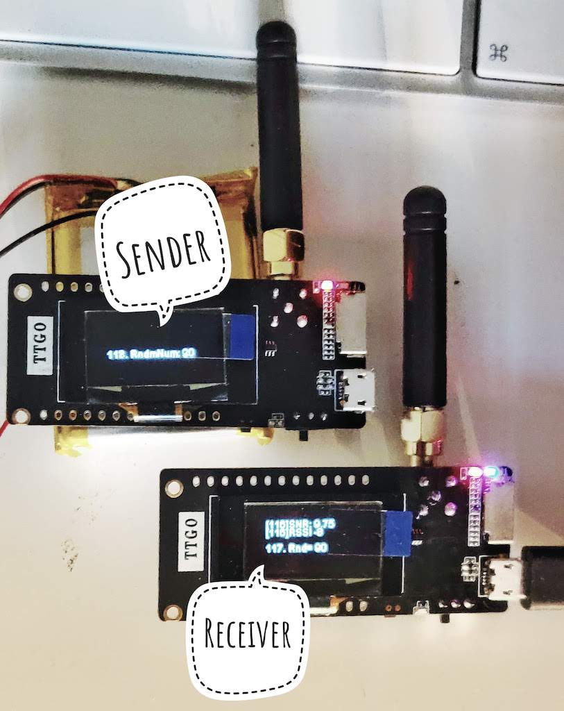

# LilyGO-TTGO-LoRa32-SenderReceiver
The LilyGO TTGO LoRa32 Sender/Receiver made really simple. Instead of RTC module and WiFi RSSi it only send counter and a random number. It is feasible for testing the working distance. At the first try I was able the get the signal (or receive LoRa packets) at about 700meters in town area (not in direct sight). 

* The sender sends: Counter and Random number
* The receiver shows: Internal counter, SNR and RSSi for LoRa packets plus received payload (Sender's Counter and Random numer )




The code is derived and simplified from: 
https://github.com/Xinyuan-LilyGO/TTGO-LoRa-Series

## Arduino studio settings: 
**dependency library files**
* arduino-LoRa from https://github.com/sandeepmistry/arduino-LoRa 
* oled-ssd1306 from https://github.com/ThingPulse/esp8266-oled-ssd1306

**Arduino settings**
1. board: "TTGO LoRa32-OLED V1"
2. upload speed:  921600
3. flash frequency: 80MHz

## Building the code:
At first change the appropriate define in <board_def.h> - whether you compile Sender (LORA_SENDER 1) or Receiver (LORA_SENDER 0). Then change the frequency to 868MHz (443 does not use pigtail antena, but PCB one)

```C
#define LORA_SENDER 0
//#define LORA_SENDER 1

#define LORA_PERIOD 868  
// #define LORA_PERIOD 915     
//#define LORA_PERIOD 433  
```

## Where to buy
Apart from your favourite chinese megastores, you can buy one at:

https://www.laskarduino.cz/lilygo-ttgo-lora32-t3_v1-6-868mhz-0-96--sma-wifi-modul/

